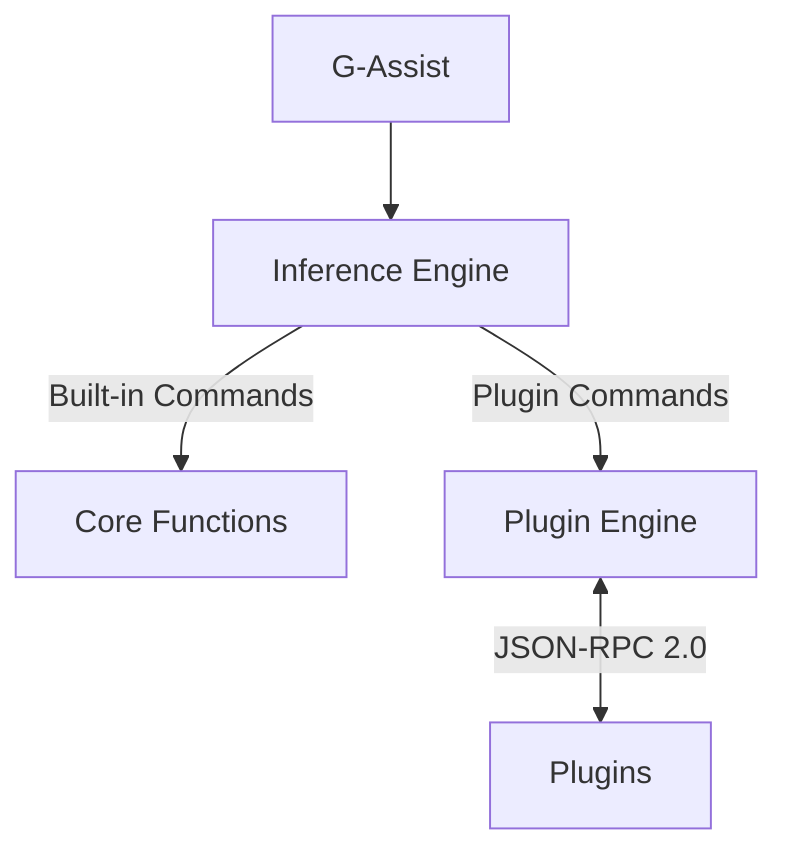

# Project G-Assist Plugins

Project G-Assist is an experimental on-device AI Assistant that helps RTX users control a broad range of PC settings, from optimizing game and system settings, charting frame rates and other key performance statistics, to controlling select peripheral lighting — all via basic voice or text commands.

Project G-Assist is built for community expansion. Whether you're a Python developer, C++ enthusiast, or just getting started — its Plugin architecture makes it easy to define new commands for G-Assist to execute. We can't wait to see what the community dreams up!

## Why Plugins Matter

- Leverage a responsive Small Language Model (SLM) running locally on your own RTX GPU
- Extend and customize G-Assist with functionality that enhances your PC experience
- Interact with G-Assist from the NVIDIA Overlay without needing to tab out or switch programs
- Invoke AI-powered GPU and system controls in your applications using C++ and python bindings
- Integrate with agentic frameworks using tools like Langflow to embed G-Assist in bigger AI pipelines

## What Can You Build?

- **Python plugins** for rapid development using the [G-Assist SDK](./plugins/sdk/python/)
- **C++ plugins** for performance-critical applications with the [header-only SDK](./plugins/sdk/cpp/)
- **Node.js plugins** for JavaScript developers with the [Node.js SDK](./plugins/sdk/nodejs/)
- **AI-driven features** using the [ChatGPT-powered Plugin Builder](./plugins/plugin-builder/)
- Custom system interactions for hardware and OS automation
- Game and application integrations that enhance PC performance or add new commands

If you're looking for inspiration, check out our sample plugins for controlling peripheral & smart home lighting, invoking larger AI models like Gemini, managing Spotify tracks, checking stock prices, getting weather information, or even checking streamers' online status on Twitch — and then let your own ideas take G-Assist to the next level!

## Quick Start

### Python Development with G-Assist

Get started quickly using our Python bindings of the [C++ APIs](https://github.com/NVIDIA/nvapi/blob/main/nvapi.h#L25283):

1. **Install the binding locally**

```bash
cd api/bindings/python
pip install .
```

1. **Chat with G-Assist**

```python
from rise import rise

# Initialize G-Assist connection
rise.register_rise_client()

# Send and receive messages
response = rise.send_rise_command("What is my GPU?")
print(f'Response: {response}')
"""
Response: Your GPU is an NVIDIA GeForce RTX 5090 with a Driver version of 572.83.
"""
```

1. **Extend G-Assist with a Plugin**

```python
from gassist_sdk import Plugin

plugin = Plugin("my-plugin", version="1.0.0")

@plugin.command("search_web")
def search_web(query: str):
    """Search the web for information."""
    plugin.stream("Searching...")  # Streaming output
    results = do_search(query)
    return {"results": results}

if __name__ == "__main__":
    plugin.run()
```

> 💡 **Requirements**:
>
> - Python 3.x
> - G-Assist core services installed
> - pip package manager

See our [Python Bindings Guide](./api/bindings/python/README.md) for detailed examples and the [Plugin SDK](./plugins/sdk/python/) for building plugins.

### NVIDIA Plugin Example - Twitch

Try these commands:

- "Hey Twitch, is Ninja live?"
- "Check if shroud is streaming"
- "Is pokimane online right now?"

### Example Responses

When a streamer is live:

```text
ninja is LIVE!
Title: Friday Fortnite!
Game: Fortnite
Viewers: 45,231
Started At: 2025-03-14T12:34:56Z
```

When a streamer is offline:

```text
ninja is OFFLINE
```

#### Key Features

- **Protocol V2** with JSON-RPC 2.0 communication
- Secure API credential management
- OAuth token handling
- Comprehensive logging system
- SDK-based development with automatic ping/pong handling
- Real-time stream status checking

#### Project Structure

```
plugins/examples/twitch/
├── manifest.json        # Plugin configuration (with protocol_version: "2.0")
├── config.json          # Twitch API credentials (add to .gitignore!)
├── plugin.py            # Main plugin code using gassist_sdk
├── requirements.txt     # Python dependencies
├── libs/                # G-Assist SDK folder
│   └── gassist_sdk/     # SDK automatically handles JSON-RPC V2 protocol
└── README.md            # Plugin documentation
```

See our [Twitch Plugin Example Code](./plugins/examples/twitch/) for a step-by-step guide to creating a Twitch integration plugin for G-Assist.

## Table of Contents

- [Project G-Assist Plugins](#project-g-assist-plugins)
- [Why Plugins Matter](#why-plugins-matter)
- [What Can You Build?](#what-can-you-build)
- [Quick Start](#quick-start)
  - [Python Development with G-Assist](#python-development-with-g-assist)
  - [NVIDIA Plugin Example - Twitch](#nvidia-plugin-example---twitch)
- [G-Assist Module Architecture](#g-assist-module-architecture)
  - [Protocol V2 Features](#protocol-v2-features)
- [Extending G-Assist (Plugins)](#extending-g-assist-plugins)
  - [Plugin Architecture](#plugin-architecture)
  - [Plugin Integration](#plugin-integration)
- [NVIDIA-Built G-Assist Plugins](#nvidia-built-g-assist-plugins)
- [Community-Built Plugins](#community-built-plugins)
- [Development Tools](#development-tools)
- [Need Help?](#need-help)
- [License](#license)
- [Contributing](#contributing)

## G-Assist Module Architecture



### Protocol V2 Features

G-Assist plugins communicate using **Protocol V2**, a robust JSON-RPC 2.0 based system:

| Feature | Description |
|---------|-------------|
| **JSON-RPC 2.0** | Standard protocol for interoperability |
| **Length-Prefixed Framing** | Binary 4-byte header ensures reliable message parsing |
| **Engine-Driven Health Monitoring** | Automatic ping/pong (no plugin heartbeat threads needed) |
| **Native Python Support** | Run `.py` files directly—no compilation required |
| **SDK-Based Development** | ~20 lines of business logic vs. ~200+ lines of boilerplate |

See the [Plugin Migration Guide](./PLUGIN_MIGRATION_GUIDE_V2.md) for full protocol details.

## Extending G-Assist (Plugins)

Transform your ideas into powerful G-Assist plugins! Whether you're a Python developer, C++ enthusiast, or just getting started, our plugin system makes it easy to extend G-Assist's capabilities. Create custom commands, automate tasks, or build entirely new features - the possibilities are endless!

### Plugin Architecture

Each plugin lives in its own directory named after the plugin (this name is used to invoke the plugin):

```text
plugins/
└── myplugin/                    # Plugin directory name = invocation name
    ├── plugin.py                # Main plugin script (or .exe for compiled)
    ├── manifest.json            # Plugin configuration with protocol_version
    ├── config.json              # Settings & credentials (optional)
    ├── requirements.txt         # Python dependencies
    └── libs/                    # SDK folder (auto-added to PYTHONPATH)
        └── gassist_sdk/
            ├── __init__.py
            ├── plugin.py
            ├── protocol.py
            └── types.py
```

**File Descriptions:**

- `plugin.py` - Main plugin script (Python plugins run directly—no compilation needed!)
- `manifest.json` - Plugin manifest that defines:
  - `manifestVersion` - manifest schema version (currently `1`)
  - `name` - plugin identifier
  - `version` - plugin version (e.g., `"1.0.0"`)
  - `description` - brief description of plugin functionality
  - `executable` - name of the executable file (e.g., `"plugin.py"`)
  - `persistent` - [true/false] whether plugin runs throughout G-Assist lifecycle
  - `protocol_version` - **`"2.0"`** for JSON-RPC V2 protocol (required)
  - `functions` - array of available functions with:
    - `name` - function identifier
    - `description` - what the function does
    - `tags` - keywords for AI model to match user intent
    - `properties` - parameters the function accepts
    - `required` - array of required parameter names
- `config.json` - Configuration file for plugin-specific settings (API keys, credentials, etc.) ⚠️ **Add to `.gitignore`**
- `libs/gassist_sdk/` - The G-Assist SDK (copy from `plugins/sdk/python/gassist_sdk/`)

> 💡 **Tip**: The plugin directory name is what users will type to invoke your plugin (e.g., "Hey myplugin, do something")

### Plugin Integration

#### How to Call a Plugin from G-Assist

The manifest file acts as the bridge between G-Assist and your plugin. G-Assist automatically scans the plugin directory to discover available plugins.

#### Two Ways to Invoke Plugins

1. **Natural Language Commands**

    ```
    What are the top upcoming games for 2025?
    ```

    The AI model automatically:
    - Analyzes the user's intent
    - Selects the most appropriate plugin
    - Chooses the relevant function to execute
    - Passes any required parameters

2. **Direct Plugin Invocation**

    ```
    Hey Logitech, change my keyboard lights to green
    ```

    - User explicitly specifies the plugin by name
    - AI model determines the appropriate function from the manifest
    - Parameters are extracted from the natural language command

> 💡 **Pro Tip**: Direct plugin invocation is faster when you know exactly which plugin you need!

## NVIDIA-Built G-Assist Plugins

Explore our official example plugins:

### Getting Started

- **[Hello World (Python)](./plugins/examples/hello-world)** - Minimal Python plugin template to get started quickly
- **[Hello World (C++)](./plugins/examples/hello-world-cpp)** - Minimal C++ plugin template for compiled plugins
- **[Hello World (Node.js)](./plugins/examples/hello-world-nodejs)** - Minimal Node.js plugin template for JavaScript developers

### AI & Information

- **[Gemini AI Integration](./plugins/examples/gemini)** - Query Google's Gemini AI for real-time information, general knowledge, and web searches
- **[Weather](./plugins/examples/weather)** - Get current weather conditions for any city
- **[Stock Market](./plugins/examples/stock)** - Check stock prices and look up ticker symbols
- **[Twitch](./plugins/examples/twitch)** - Check if streamers are live and get stream details

### Smart Lighting

- **[Corsair iCUE](./plugins/examples/corsair)** - Control Corsair RGB peripheral lighting (keyboard, mouse, headset)
- **[Logitech G HUB](./plugins/examples/logiled)** - Control Logitech G RGB peripheral lighting (keyboard, mouse, headset)
- **[Nanoleaf](./plugins/examples/nanoleaf)** - Control Nanoleaf smart lighting panels
- **[OpenRGB](./plugins/examples/openrgb)** - Universal RGB lighting control for multiple device brands

### Automation & Entertainment

- **[Spotify](./plugins/examples/spotify)** - Control Spotify playback, manage playlists, and get track information
- **[IFTTT](./plugins/examples/ifttt)** - Trigger IFTTT applets and automate smart home routines
- **[Discord](./plugins/examples/discord)** - Send messages, charts, screenshots, and clips to Discord channels

## Community-Built Plugins

Check out what others have built:

- [Your Plugin Here] - Submit your plugin using a pull request! We welcome contributions that:
  - Follow our [contribution guidelines](CONTRIBUTING.md)
  - Include proper documentation and examples
  - Have been tested thoroughly
  - Add unique value to the ecosystem

## Development Tools

- **[Plugin SDK (Python)](./plugins/sdk/python/)** - Protocol V2 SDK for building plugins with minimal boilerplate
- **[Plugin SDK (C++)](./plugins/sdk/cpp/)** - Header-only C++ SDK for performance-critical plugins
- **[Plugin SDK (Node.js)](./plugins/sdk/nodejs/)** - JavaScript SDK for Node.js plugins
- **[Plugin Emulator](./plugins/plugin_emulator/)** - Test and debug plugins locally without G-Assist running
- **[Python Bindings](./api/bindings/python/)** - Python API for interacting with G-Assist
- **[C++ API](./api/c++/)** - Native C++ interface for performance-critical applications
- **[ChatGPT-powered Plugin Builder](./plugins/plugin-builder/)** - AI-assisted plugin development tool
- **[Plugin Migration Guide](./PLUGIN_MIGRATION_GUIDE_V2.md)** - Migrate legacy V1 plugins to Protocol V2

## Need Help?

- Report issues on [GitHub](https://github.com/nvidia/g-assist)

## License

This project is licensed under the Apache License 2.0 - see the [LICENSE](LICENSE) file for details.

## Contributing

We welcome contributions! Please see our [Contributing Guide](CONTRIBUTING.md) for details.
